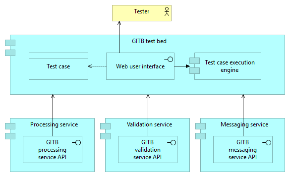

Introduction
============

The goal of the current documentation is to explain the purpose of GITB test services, when and how to use them,
as well as guide you in creating your own service. It is meant as a comprehensive reference but also an easy to follow guide
to help you get started.

What are the GITB service specifications?
-----------------------------------------

The `GITB project`_ represents a CEN standardisation initiative funded by the European Commission’s DG GROW 
to provide the specifications for a generic interoperability test bed and their implementation in the form 
of the GITB test bed software. The focus of these specifications and software is not any kind of testing 
(e.g. performance, regression, penetration) but rather conformance and interoperability testing. Simply
put, *conformance testing* verifies that the requirements of a given specification are met, whereas
*interoperability testing* comes as a second step to verify that two or more parties can interact as expected.
Furthermore, the focus here is on technical specifications related to e.g. messaging protocols or content,
whereas the parties previously mentioned would typically be software components.

A key element of the GITB specifications is the set of **GITB test service APIs**. These are SOAP web service
interfaces (defined using WSDLs and XSDs) that allow extension of the core GITB test bed software by means of
decoupled components that offer domain-specific capabilities. Such capabilities may be specific to a given 
project's testing needs and would not be offered by the test bed out of the box, such as the handling of a custom 
communication protocol or the validation of arbitrary content. The purpose of the GITB test service APIs is to 
define a common interface between such components and the test bed so that they can interact in a consistent 
manner as part of test cases.

Currently three types of services are defined:

  * **Validation services:** Used to validate content and produce a validation report.
  * **Messaging services:** Used to send and receive content to and from the test bed using an arbitrary communication protocol.
  * **Processing services:** Used as utility functions to process input and produce output.

.. note::
    **GITB-compliant service:** A service implemented to conform to a GITB test service API may also be referred to as a
    *GITB-compliant service* of the specific type. For example, if the service in question implements the GITB validation 
    service API it would be termed a *GITB-compliant validation service*.

.. _GITB project: http://www.cen.eu/work/areas/ict/ebusiness/pages/ws-gitb.aspx

Where are they used?
~~~~~~~~~~~~~~~~~~~~

The short answer is that the GITB test services are used by the GITB test bed software (or another test bed implementation 
based on its specifications) to extend its capabilities.

Keep in mind however that these test services are simply SOAP web services that use a specific API. As such, they could be
used independently of the test bed by any SOAP client; the use of a common API serves in this case to allow service
calls to be consistent and share the same semantics. In practice, messaging and processing services are not typically
used in a standalone manner as they are really focused on making additional capabilities available to test sessions. Validation 
services however, given also the simplicity of the involved API, are good candidates for independent use. It is often
the case that validation services are used as part of unit testing processes.

How are they maintained?
~~~~~~~~~~~~~~~~~~~~~~~~

Following the initial work from the CEN GITB workgroup, the maintenance and evolution of the GITB specifications has been taken over 
by the European Commission, specifically the `Interoperability Test Bed Action`_ of DIGIT ISA. The Action maintains the GITB software 
and specifications based on the needs of the testing community and carries out evolutive
maintenance with regular releases. Regarding the GITB test service specifications, effort is made to always introduce changes 
in a backwards-compatible manner, adding capabilities rather than changing existing ones. Releases of the GITB service specifications 
and its version numbers currently follow the versioning of the GITB software.

.. _Interoperability Test Bed Action: https://joinup.ec.europa.eu/solution/interoperability-test-bed/about

Core concepts
-------------

Before diving into the GITB service specifications it is important to be aware of certain core concepts.

.. index:: Test case

Test case
~~~~~~~~~

A **test case** represents a set of steps and assertions that form a cohesive scenario for testing purposes. 
These are captured in a single XML file authored in the `GITB TDL`_ (GITB Test Description Language).

.. _GITB TDL: https://www.itb.ec.europa.eu/docs/tdl/latest/

.. index:: Test suite

Test suite
~~~~~~~~~~

A **test suite** is used to group together related test cases into a cohesive set. A test suite can include
metadata such a name and description that provide useful context to understand the purpose of its contained
tests. A test suite is expressed as an XML file and is bundled in a ZIP archive along with its contained 
test cases and the resources they use.

.. index:: Test session

Test session
~~~~~~~~~~~~

A **test session** represents a single execution of a test case. It typically involves the provision of
configuration from the user starting the test, goes through the steps the test case foresees, and eventually
completes providing the session's overall result.

.. index:: Test session context
.. index:: Session context

Test session context
~~~~~~~~~~~~~~~~~~~~

The **test session context** can be considered a persistent store specific to a given test session that is used to record
values. These values can either be configuration parameters provided before the test session starts, configuration parameters
generated during the test session's initiation, or values that are added dynamically during the session as a result of the 
ongoing test steps. The test session context is very important in that it gives a level of control above individual test 
steps that enable the testing of complete conversations. In addition, its ability to store and lookup arbitrary content dynamically
makes it possible to implement complex flows and control logic.

The test session context can be viewed as a map or keys to values, where each key is a string identifier and the value can be 
any supported type, including additional nested maps.

.. index:: Actor
.. index:: SUT (System Under Test)

Actor
~~~~~

An **actor**, from the perspective of GITB, represents a party involved in the overall process that the test cases
aim to test. What exactly is an actor depends fully on the tests or the specification they relate to. Here are
some examples:

* A specification that foresees sending a message from one party to another could define a "Sender" and "Receiver" 
  actor to represent the involved parties.
* A solution that foresees a central EU portal exchanging information with national endpoints could define the "Portal" 
  and "National endpoint" as actors.
* A content specification (e.g. XML-based) for which we simply want to allow users to upload samples for validation 
  could define a "User" actor to represent this role in test cases.

Once actors are defined they play an important role in the testing process as follows:

* They define properties relevant to the testing (think of them as actor-specific configuration elements). Such properties
  are grouped into **endpoints**, named configuration sets that can be referenced in test cases.
* Each test case foresees that actors are either simulated by the test bed or are the focus of the test. In the latter case
  they are referred to as having a role of **SUT** (System Under Test).

.. index:: Messaging handlers
.. _introduction-concepts-messaging-handlers:

Service handlers
~~~~~~~~~~~~~~~~

**Service handlers** are effectively synonymous to the GITB test services. They represent from the perspective of a given test case
the implementation to carry out specific validation, messaging or processing steps. The distinction here is that the implementation of 
these handlers could also be a component, embedded within the test bed software itself, that implements the same operations but is 
called locally. Such embedded implementations are of course limited to truly generic capabilities that are commonly required.

More information on service handlers and embedded ones in particular can be looked up in the `GITB TDL documentation`_.

.. _GITB TDL documentation: https://www.itb.ec.europa.eu/docs/tdl/latest/handlers/

Test service architecture
-------------------------

A good way of better understanding how GITB test services are used is to consider the test bed as a *test-oriented Enterprise Service Bus (ESB)*. 
This is illustrated in the following diagram:

  Use of test services by the test bed

Testers use the test bed through its user interface to lookup and execute one or more test cases. These test cases are authored in the GITB TDL [REF]
and capture the testing logic as a sequence of steps, certain of which may need validation, processing or messaging that is not natively supported by 
the test bed. The test case developer may delegate the implementation of such a step to an external service that implements the relevant interface by
providing the service's WSDL file address as the value for the step's ``handler`` attribute.

.. code-block:: xml

    <!--
      Validation using an embedded validation handler.
      Lookup "StringValidator" as an embedded validator component within the test bed.
    -->
    <verify handler="StringValidator" desc="Check string">
        <input name="actualstring">$aString</input>
        <input name="expectedstring">'expected_string'</input>
    </verify>
    <!--
      Validation using a remote validation handler.
      Lookup the validator as a remote SOAP web service based on its WSDL file.
    -->
    <verify handler="https://SERVICE_ADDRESS?WSDL" desc="Validate content">
        <input name="contentToValidate">$content</input>
    </verify>

From the test case's perspective there is no difference between an embedded and remote handler apart from the value for the ``handler`` attribute.
The actions to prepare, call, and post-process the relevant step (``verify`` in the above example) are identical. The only difference is 
that the test bed, when executing the step, calls the same method signatures replacing what would be local method invocations with remote SOAP web 
service calls.

Decoupled test services are ideally suited to bring domain-specific logic to the test bed and also to extend its capabilities without impacting its operation.
Simply put, if you need to perform arbitrary processing on content and then validate it in a specific way, you can set this up in services that the test bed can 
immediately start using. The test bed acts as the orchestrator of service calls and other test case steps, following the description laid out in the GITB TDL test case
it is executing. In addition, it adds the test session context as an overarching construct that brings meaning and a persistent conversional state to otherwise 
one-off service calls: you can process content in one step, save the result in the test session context, and then several steps later you can retrieve it to use for
further processing, messaging of validation. In short:

  * The **test bed** executes test sessions, orchestrates service calls and adds context over steps.
  * **Test services** add new capabilities on-the-fly to cover domain-specific needs.

Test services as part of a testing campaign
-------------------------------------------

To better understand how test services fit within the test bed it is useful to consider how they would be approached as part of the overall setup of a project's 
testing campaign. From a high-level perspective, setting up the conformance testing for a project would involve the following steps:

  #. Create and customise the project's domain, specification(s) and community in the test bed (see [REF] for details).
  #. Determine what the project's users are expected to test for. This will help identify the specification actors and notably the actors to be simulated and 
     the one(s) representing the System Under Test (SUT).
  #. Determine the overall structure of test cases (e.g. what messaging is involved, what is validated), the different types of test cases (e.g. tests where the SUT
     sends messages versus tests where it receives them) and their organisation in test suites.
  #. Check the existing capabilities of the test bed and the GITB TDL (by consulting [REF] and [REF]) to see if all identified testing needs can be covered.
  #. Address missing capabilities by designing GITB-compliant test services. Implement and test these services to ensure they fully match the project's testing needs and
     actual specifications.
  #. Develop the GITB TDL test cases making use of the implemented test services and deploy them to the test bed in appropriate test suites.
  #. Create organisation accounts for the project's users to begin testing.

It is important to consider test services as a tool rather than a requirement. The fact that a project foresees the exchange of messages between different parties does not
mean that it needs a custom-built messaging service. If your project uses an already supported messaging protocol such as SOAP web service calls where a ``SoapMessaging``
messaging handler would be used [REF] then you don't need to implement your own. Similarly if your validation needs are limited to e.g. XML validation, you could use
the existing ``XSDValidator`` [REF] and ``SchematronValidator`` [REF] in validation steps.

A similar argument could however also be made in the other direction. Even if an existing embedded service handler is available, you could opt to implement a custom replacement
if it facilitates testing for you and your users. As an example consider validation of XML content that includes validation against a XSD file and separate
validations against multiple Schematron files. Using existing embedded validators you would need to add multiple ``verify`` [REF] steps to your test case: one for the XSD
validation and one per Schematron file. You could choose to replace these with a single custom validator that would display a single validation step to your users and allow
easier updating of the validation artefacts through the single centralised service.

Specification links
-------------------

The following table provides the links to access the latest version of the GITB specifications. These include the WSDLs for 
messaging, processing and validation services as well as the XSDs for all GITB type definitions.

.. csv-table::
  :header: "Specification", "Description", "Link"

  GITB core elements, The XSD defining core elements used in other GITB XSDs, https://www.itb.ec.europa.eu/specs/latest/gitb_core.xsd
  GITB test description language (TDL), The XSD defining the types used when defining TDL test suites and test cases, https://www.itb.ec.europa.eu/specs/latest/gitb_tdl.xsd
  GITB test presentation language (TPL), The XSD defining types used to report on the status of a test session, https://www.itb.ec.europa.eu/specs/latest/gitb_tpl.xsd
  GITB test reporting language (TRL), The XSD defining the types used to report step output, https://www.itb.ec.europa.eu/specs/latest/gitb_tr.xsd
  GITB messaging service API, The WSDL defining messaging service operations, https://www.itb.ec.europa.eu/specs/latest/gitb_ms.wsdl
  GITB messaging service types, The XSD defining the messaging service message types, https://www.itb.ec.europa.eu/specs/latest/gitb_ms.xsd
  GITB validation service API, The WSDL defining validation service operations, https://www.itb.ec.europa.eu/specs/latest/gitb_vs.wsdl
  GITB validation service types, The XSD defining the validation service message types, https://www.itb.ec.europa.eu/specs/latest/gitb_vs.xsd
  GITB processing service API, The WSDL defining processing service operations, https://www.itb.ec.europa.eu/specs/latest/gitb_ps.wsdl
  GITB processing service types, The XSD defining the processing service message types, https://www.itb.ec.europa.eu/specs/latest/gitb_ps.xsd
  GITB test bed service API, The WSDL defining test bed service operations, https://www.itb.ec.europa.eu/specs/latest/gitb_tbs.wsdl
  GITB test bed service types, The XSD defining the test bed service message types, https://www.itb.ec.europa.eu/specs/latest/gitb_tbs.xsd

The complete set of latest GITB specifications can be downloaded from https://www.itb.ec.europa.eu/specs/latest/gitb_all.zip.

The final GITB workgroup report can be downloaded here [:download:`CEN_WS_GITB3_CWA_Final.pdf`].

Documentation structure
-----------------------

The chapters that follow this introduction provide details for each service type, specifically on their purpose, concepts, implementation and use:

  * [REF] to validate arbitrary content.
  * [REF] to send and receive messages or simulate communication.
  * [REF] to process input and produce output.

[REF] complements the above chapters by documenting common concepts that are shared across all service types. Finally, [REF] provides information on the
available [REF], that facilitate the creation of new service instances and serve as rich working examples.

.. note::
    **Code samples:** The code samples included in this documentation are written in Java [REF] and use the Spring framework [REF], with web service 
    implementations specifically using Apache CXF [REF]. Moreover, the available template services [REF] are themselves designed as Spring Boot [REF] 
    applications, based on the same technology stack.

    This design choice reflects a popular Industry approach but is by no means binding. You may choose to use the development framework and language 
    of your choice as long as it supports the implementation of SOAP web services.