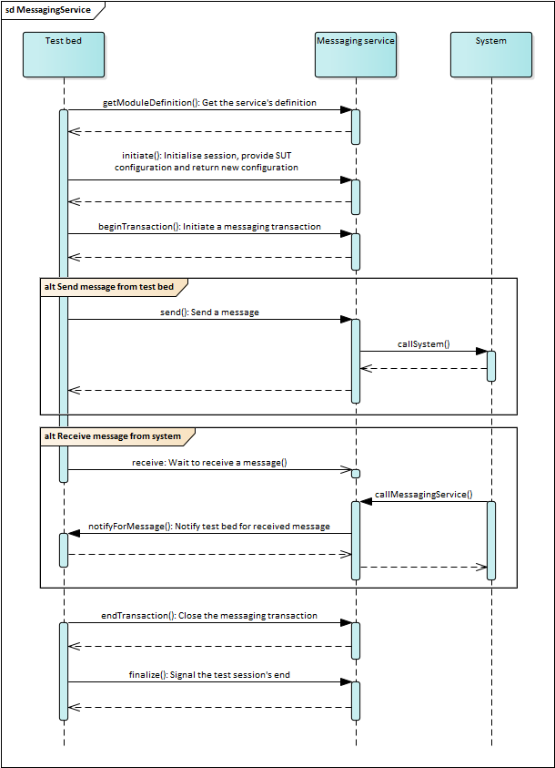

.. _messaging:

Messaging services
==================

**GITB messaging services** are key components used by the test bed to extend its communication capabilities. A messaging service allows
the abstraction of messaging details behind logical operations to send and receive messages, the implementation details of which are 
contained within the service implementation. Furthermore, any type of communication can be supported, both in terms of the underlying 
protocol as well as in terms of synchronicity.

A messaging service is typically used to act as a **communication adapter** between the test bed and an external system. Acting in this role 
the messaging service sends messages from the test bed to the system and also from the system to the test bed, exposing the information 
sent and received for use by the test session. A service could however also be used as a **simulator**, realising a test actor for the purpose 
of a test session without the presence of an actual system. It would be up to the messaging service to determine what needs to happen when it 
is asked to send a message, and also under what conditions will it signal a message's reception to the test bed.

Messaging services operate using a concept of **sessions** which are linked one-to-one with the test sessions running in the test bed. Over the 
course of such sessions the messaging service may maintain on its side any required state that helps add context to the overall messaging
conversation. The service may use this session state to define properties relevant to multiple related calls and also to keep track of the actual
communication to and from remote systems. This latter point is frequently leveraged in messaging services that are used in relation to
asynchronous communication where the service needs to be able to correlate received messages to existing test sessions.

To better understand this last point consider the example of a test on asynchronous message posting between System A and System B:

    #. The test bed, simulating System A, posts a message for the actual System B on a remote queue (consider it a bulletin board).
    #. System B is expected to asynchronously read the message and take some action.
    #. Once complete, System B prepares a response in which it references the received message and provides the action's result.
    #. System B posts this response message on the remote queue for System A (the test bed) to pick up.
    #. The test bed picks up the response message and validates its contents.

An implementation of a messaging service for this type of communication would, upon reception of :ref:`messaging__operations__send` calls, post the message on the queue.
When receiving a :ref:`messaging__operations__receive` call, the service will start polling the message queue to see if a new message has arrived from System B, and if so, 
will notify the test bed. If the queue in question is used by multiple systems concurrently and potentially in multiple concurrent test sessions, 
we are faced with the problem of how to correlate messages with test sessions. This is a prime case where maintaining state in the messaging
service is key. Doing so typically involves the following steps:

    #. When the test session starts the messaging service creates a session.
    #. At an appropriate time, either at test session start, at transaction start, or upon receiving a :ref:`messaging__operations__receive` call, the messaging service
       records correlation metadata in the session's state (the session identifier is passed by the test bed on every call).
    #. During its polling, the messaging service checks new messages against the correlation data of its active test sessions.
    #. When a match is made, the service notifies the relevant test session passing it the received content.

Overall the state recorded by the messaging service can be as simple or as complicated as needed. In certain scenarios the service may maintain even
complete messages in memory in order to subsequently determine what should happen when the test bed signals a :ref:`messaging__operations__receive`. Always keep in mind that
when the test bed executes a `send`_ or `receive`_ step these are more logical operations whereas what actually happens and when is up to the
messaging service. Such concerns represent key design decisions you need to take when implementing your service.

.. index:: notifyForMessage
.. _messaging__callbacks:

Test bed call-backs
-------------------

Messaging services differ from validation and processing services in that they need to support asynchronous operations. When the test bed tells the
service to :ref:`messaging__operations__send` a message the operation occurs synchronously. However, when the test bed signals a :ref:`messaging__operations__receive` to the service, the corresponding
message will often not be available immediately; the service will typically need to wait until the remote system sends a message that it can
then pass onto the test bed. To address this need the GITB messaging service API foresees a **call-back operation** to notify the test bed. The steps that follow
summarise how this is used to signal received messages:

    #. When the test bed initiates a test session it contacts the messaging service with operation :ref:`messaging__operations__initiate`. As part of this operation it
       passes its addressing information through `WS-Addressing`_ that adds the reply address in a specific SOAP header element. The address is 
       specifically the one for its call-back service endpoint.
    #. In the implementation of the :ref:`messaging__operations__initiate` operation the service creates a session and stores in it the received test bed call-back address.
    #. When the test bed runs a `receive`_ step it calls the service's :ref:`messaging__operations__receive` operation and blocks until the expected message is received.
    #. The messaging service eventually receives a message from the remote system and, by comparing appropriate correlation information in the message
       and the active sessions, detects the test session to notify.
    #. The service then constructs a ``TAR`` report containing the received information and provides it along with the session identifier in a call to the 
       test bed's ``notifyForMessage`` operation. The address for this call is obtained from the addressing information stored earlier in the session.
    #. The test bed, in the implementation of the ``notifyForMessage`` operation, extracts the information, stores it in the session context and signals the 
       relevant test session to proceed.

.. note::
    Using `WS-Addressing`_ to determine the reply-to address for the test bed is not strictly necessary. You can also define the address as part of the
    service's configuration if this is not expected to change. It's value would be ``http://[GITB_SRV_HOST]:[GITB_SRV_PORT]/itbsrv/MessagingClient``.

.. _messaging__configuration:

Exchanging configuration for a test session
-------------------------------------------

An important capability of messaging services is the possibility to provide back to the test bed configuration properties to be used in a specific test 
session. This occurs as part of the initialisation of a test session (see operation :ref:`messaging__operations__initiate`) allowing session-specific configuration to be 
defined. As an example consider a messaging service that is to receive messages from a remote system, in which a session-specific token needs to be 
included. This token can be generated when the test session initialises and presented to the tester in order to configure appropriately the remote system.

Overall the configuration exchange that takes place at the start of a test session can be summarised as follows:

    #. A user selects a test case to execute.
    #. The test bed initialises a new test session.
    #. The configuration from the side of the test bed (e.g. fixed values from the test case or values provided by the user for the System Under Test)
       are sent to the messaging service.
    #. The messaging service processes the received configuration and optionally generates configuration values to return to the test session.
    #. Any generated configuration from the messaging service is presented to the user. This is also stored in the test session context for use
       in test case steps.
    #. The user can now start the test session.

The exchange of configuration for a test session takes place through the :ref:`messaging__operations__initiate` operation. Check its documentation to see how to manage this.

.. _messaging__implementing:

Implementing the service
------------------------

A GITB messaging service is a web application that at least exposes a web service implementing the `GITB messaging service API`_.
The easiest way to get up and running is to use the template messaging service available as a Maven Archetype (see :ref:`templates`).

Once you have answered the prompts you will have a fully functioning GITB messaging service implemented using the `Spring Boot`_ framework 
that you can adapt to your specific needs. Alternatively of course you can implement the service from scratch in any way and technology stack you prefer.
In this case a very useful resource is the ``gitb-types`` library that includes classes for all GITB types, service interfaces and service clients. This 
is available on `Maven Central`_ and can be added as a Maven dependency as follows:

.. code-block:: xml

    <dependency>
        <groupId>eu.europa.ec.itb</groupId>
        <artifactId>gitb-types-jakarta</artifactId>
        <version>1.23.1</version>
    </dependency>

.. note::

    The ``gitb-types`` library is also available in a variant with classes using the Javax APIs. See :ref:`common__gitb-types` for details.

Check the :ref:`templates` description for more details on the content and use of the sample messaging service. In terms of its initial definition,
a messaging service needs to be defined as an implementation of the ``com.gitb.ms.MessagingService`` interface:

.. code-block:: java

    @Component
    public class MessagingServiceImpl implements com.gitb.ms.MessagingService {
        ...
    }

The :ref:`following sections <messaging__operations>` cover the service's operations, whereas as the final step you will also need to
:ref:`register the service endpoint <messaging__configuring>` as part of your configuration.

.. _messaging__operations:

Service operations
------------------

.. note::
    **Service WSDLs and XSDs:** The WSDL and XSD for messaging services are listed in the :ref:`specification reference section<introduction__specification_links>`.

The following figure illustrates the operations that a messaging service needs to implement and their use by the test bed. In addition, the call-back operations
that the messaging service calls on the test bed are also presented.

  Use of the messaging service operations

.. index:: getModuleDefinition (Messaging)
.. _messaging__operations__getModuleDefinition:

getModuleDefinition
~~~~~~~~~~~~~~~~~~~

The ``getModuleDefinition`` operation is used to return information on how the service is expected to be used. In case
the service is specific to a given project and not meant to be published and reused, you can provide an empty implementation
as follows:

.. code-block:: java

    public GetModuleDefinitionResponse getModuleDefinition(Void parameters) {
        return new GetModuleDefinitionResponse();
    }

If you plan to publish a reusable and well-documented service for others to use, it is meaningful to provide a complete implementation.
In this case, this method is used to document:

  * The identification **metadata** of the service.
  * The **configuration** parameters it expects.
  * The variable **inputs** that are expected.
  * The **outputs** that are produced.

The difference between configuration parameters and inputs is more of a conceptual point in that configuration parameterises the
messaging to take place, whereas inputs represent the actual message elements to process. In practice configuration parameters are often
skipped in favour of inputs that serve both to pass content as well as any additional parameterisation needed by the messaging service.

This main purpose of the ``getModuleDefinition`` operation is to determine the inputs expected by the service. The messaging service API defines 
generally how inputs and outputs are passed but not how many in this specific case nor the name and value of each one. When used by the test bed this operation 
determines:

  * The types of expected inputs. This enables automatic type conversions when passing the call's parameters.
  * The mandatory inputs. The test bed checks that all such inputs are accounted for before calling the service's operations
    to fail quickly without unnecessary calls.

The following example shows a complete implementation of the ``getModuleDefinition`` operation.

.. code-block:: java

    public GetModuleDefinitionResponse getModuleDefinition(Void parameters) {
        GetModuleDefinitionResponse response = new GetModuleDefinitionResponse();
        response.setModule(new MessagingModule());
        // Set an identifier for the service.
        response.getModule().setId("MyMessagingService");
        response.getModule().setMetadata(new Metadata());
        // Set a name for the service (the identifier is reused here).
        response.getModule().getMetadata().setName(response.getModule().getId());
        // Set a version string for the service.
        response.getModule().getMetadata().setVersion("1.0.0");
        response.getModule().setInputs(new TypedParameters());
        // Define the service's input parameters.
        response.getModule().getInputs().getParam().add(createParameter(...));
        return response;
    }

The metadata set for a messaging service (identifier, name and version) are not used in practice. In addition, definition of outputs is often skipped
as this is purely for documentation purposes. What is important to define correctly are the input parameters, the definitions of which in this example are
constructed with the help of a ``createParameter()`` method. See :ref:`common__documenting_input_output` for full details on how these parameters need to be defined.
Note that as of release 1.10.0, you are no longer obliged to define service inputs and output (i.e. both are optional), although doing so remains a best practice as
it allows client-side input verification.

.. note::
    **Required inputs for messaging services:** Specifying an input as required (i.e. setting its ``use`` to ``UsageEnumeration.R``) allows the test bed to proactively test
    that it is provided. This however causes a problem for messaging services that both need to :ref:`messaging__operations__send` and :ref:`messaging__operations__receive` content as there is no distinction between the 
    inputs of each operation in the documentation returned by the :ref:`messaging__operations__getModuleDefinition` operation. A required :ref:`messaging__operations__send` input will typically not apply for a :ref:`messaging__operations__receive`
    call resulting always in an error when checking them from the side of the test bed. The cause of this is a historical update of the messaging service API that, in
    favour of backwards compatibility, introduced this ambiguity as a negative side-effect.
    
    Until this issue is resolved in the specification, input parameters should either be **skipped** or defined as **optional** (i.e. ``UsageEnumeration.O``). The presence or not
    of each expected input must then be checked in the service's :ref:`messaging__operations__receive` and :ref:`messaging__operations__send` implementations.

.. index:: initiate
.. _messaging__operations__initiate:

initiate
~~~~~~~~

The ``initiate`` operation is called when a test case has been selected for execution and a new test session is being initialised. At the point it is called the 
test session is created but has not actually started yet to go through the test case's steps. The purpose of this operation is to:

    * Create a messaging session.
    * Record the test bed's call-back address.
    * Receive configuration properties from the test bed.
    * Provide configuration properties to the test bed.

As explained in the overview section, messaging services typically need sessions to manage state in order to store configuration, message correlation data,
as well as the call-back address for the test bed to signal received messages (see :ref:`messaging__callbacks`). The ``initiate`` operation is expected to create such a session,
assign it a unique identifier, and return the identifier as part of the operation's response. This identifier is then returned by the test bed on all 
subsequent calls, thus allowing the service to correctly distinguish and handle concurrently executing test sessions. The service needs to ensure that the 
identifier is stored in a construct that will allow state to be associated with it, making it possible to subsequently read it and (most likely) update it. In terms 
of implementation it needs to be thread-safe as you may have numerous concurrent sessions and can range from something as simple as an in-memory concurrent
map to a database.

The initial data to store in the session are:

    * The generated session identifier (to enable subsequent lookups).
    * The test bed's call-back address.

The following example illustrates an ``initiate`` implementation (using the `Spring framework`_) that uses a separate component to manage session state:

.. code-block:: java

    private static final QName WSA_REPLYTO_QNAME = new QName("http://www.w3.org/2005/08/addressing", "ReplyTo");
    @Autowired
    private SessionManager sessionManager = null;
    @Resource
    private WebServiceContext wsContext = null;

    public InitiateResponse initiate(InitiateRequest parameters) {
        InitiateResponse response = new InitiateResponse();
        // Get the ReplyTo address for the test bed call-backs based on WS-Addressing.
        String replyToAddress = getReplyToAddress();
        // Create a session and return its identifier.
        String sessionId = sessionManager.createSession(replyToAddress);
        response.setSessionId(sessionId);
        return response;
    }

    private String getReplyToAddress() {
        // Get the list of headers from the request.
        List<Header> headers = (List<Header>) wsContext.getMessageContext().get(Header.HEADER_LIST);
        for (Header header: headers) {
            // Find the "ReplyTo" header.
            if (header.getName().equals(WSA_REPLYTO_QNAME)) {
                // Extract and return the address to the call-back endpoint's WSDL.
                String replyToAddress = ((Element)header.getObject()).getTextContent().trim();
                if (!replyToAddress.toLowerCase().endsWith("?wsdl")) {
                    replyToAddress += "?wsdl";
                }
                return replyToAddress;
            }
        }
        return null;
    }    

.. note::
    **Session management simplification:** As of release 1.15.0 returning a session ID in the ``InitiateResponse`` is optional.
    In this case the test bed will use the overall test session ID (as opposed to a generated messaging session ID) in all 
    subsequent calls. The difference in this case is that you will not be aware of this ID before it is referred to in e.g. 
    a `send`_ or `receive`_ call. As such, if you want to track sessions, your service implementation should be adapted to record 
    a new session when a session ID is first encountered.

Extraction of the "ReplyTo" header in ``getReplyToAddress()`` is critical as it is this address that allows the service to provide received messages to the
test bed. You could skip this if the service is only ever going to be used to send messages (i.e. the relevant test cases never contain a `receive`_ step).
Alternatively you could configure a fixed value for the call-back address although this is a bad practice: it ties the service to a specific test bed instance
and it does not automatically handle address changes. With respect to session management, the above example uses a custom ``SessionManager`` component, the main code of 
which is provided in the following code block:

.. code-block:: java

    @Component
    public class SessionManager {

        // Use a thread-safe construct to store sessions.
        private Map<String, Map<String, Object>> sessions = new ConcurrentHashMap<>();

        public String createSession(String callbackURL) {
            if (callbackURL == null) {
                throw new IllegalArgumentException("A callback URL must be provided");
            }
            // Generate a unique session ID.
            String sessionId = UUID.randomUUID().toString();
            // The information of a session is stored in a map.
            Map<String, Object> sessionInfo = new HashMap<>();
            // Add the call-back URL to the session data.
            sessionInfo.put("CALLBACK_URL", callbackURL);
            sessions.put(sessionId, sessionInfo);
            return sessionId;
        }

        public void destroySession(String sessionId) {
            sessions.remove(sessionId);        
        }

        public Object getSessionInfo(String sessionId, String infoKey) {
            Object value = null;
            if (sessions.containsKey(sessionId)) {
                value = sessions.get(sessionId).get(infoKey);
            }
            return value;
        }

        public void setSessionInfo(String sessionId, String infoKey, Object infoValue) {
            sessions.get(sessionId).put(infoKey, infoValue);
        }
    }

Decoupling session management into a separate component is a good practice as it allows session state to be accessed by any component involved in the
service's processing. In addition, it hides implementation details allowing e.g. a switch to using a database to take place without impacting other code.
A fully functioning implementation of call-back and session management is provided through the available template messaging service (see :ref:`templates`).

The second main concern of the ``initiate`` operation is the management of **configuration** to address values received from the test bed and also 
provided to the test bed as a response. To understand how configuration is managed you need to be familiar with the GITB concepts of **actors** and **endpoints**
which are discussed in detail in the GITB TDL documentation on `Test Suites`_ and `Test Cases`_. In summary, what you need to know is the following:

    * Test cases are based on interactions between one or more **actors** (e.g. a "Client" and a "Server"), one of which will always be the SUT
      (System Under Test) whereas the others are simulated.
    * Messaging services are defined as the **handler** of communication between a "from" actor and a "to" actor and act as the implementation of the 
      simulated one(s).
    * Actors may define configuration properties grouped in a named set called an **endpoint**.
    * For the **SUT actor** (i.e. the actual system we are testing), properties are provided by the test bed user before starting the test session.
    * For **simulated actors** (i.e. the ones implemented by the messaging service), properties are provided by the messaging service.
    * The ``initiate`` operation call provides the SUT actor configuration to the service and returns the generated configuration (if any).

To illustrate this process consider the following example:

.. code-block:: java

    public InitiateResponse initiate(InitiateRequest parameters) {
        // Handle call-back address and session creation.
        String sessionId = createSession();
        // Process (if needed) the configuration received from the test bed. 
        processReceivedConfiguration(parameters.getActorConfiguration());
        // Generate configuration to return to the test bed.
        ActorConfiguration configForSut = new ActorConfiguration();
        // Set the name of the simulated actor this service implements.
        configForSut.setActor("Server");
        // Set the name of the endpoint expected by the SUT actor.
        configForSut.setEndpoint("serverAddressInformation");
        // Build the configuration entry for the "address" property.
        Configuration entry = new Configuration();
        entry.setName("address");
        entry.setValue("an_address");
        configForSut.getConfig().add(entry);
        // Construct and return response.
        InitiateResponse response = new InitiateResponse();
        response.setSessionId(sessionId);
        response.getActorConfiguration().add(configForSut);
        return response;
    }

This example assumes a test case with two actors:

    * Actor "Client" that has the role of SUT. This defines an endpoint named "serverAddressInformation" as a placeholder for the configuration to receive.
    * Actor "Server" that is simulated. The messaging service here returns as configuration the address at which the "Client" needs to make calls on. This 
      is set with endpoint name "serverAddressInformation" to match the expected placeholder of the "Client" actor.

The result of this implementation will be twofold:

    * Before the test session starts, the user will be presented the "address" configuration value returned by the simulated "Server" actor. This is done in case the user needs 
      to configure this address in the actual system that will be tested.
    * The "address" configuration value will be subsequently accessible in the test session through the expression ``$Client{Server}{address}``
      (i.e. ``$SUT_ACTOR_ID{SIMULATED_ACTOR_ID}{PARAMETER_NAME}``).

Finally, note that when calling the ``initiate`` operation, the test bed passes the configuration properties defined for the other test case actors. These
include properties configured in the test case and also entered by the test bed user for the SUT actor. This allows the messaging service implementation to
both consider them before returning its own configuration values and also to record them in the session for subsequent use.

.. index:: beginTransaction (Messaging)
.. _messaging__operations__beginTransaction:

beginTransaction
~~~~~~~~~~~~~~~~

The exchange of messages to and from the test bed always take place within a transaction. This transaction is used to determine the messaging handler 
implementation as well as the participating actors and the direction of the communication (the "from" and "to" actors). A transaction begins through
the `btxn`_ GITB TDL step at which time the test bed notifies the messaging service by calling its ``beginTransaction`` operation. This call includes:

    * The "from" and "to" actor names.
    * Any configuration properties passed specifically to the transaction.
    * The session identifier.

Typically no special action is needed on the side of the messaging service when a transaction starts. The implementation of the method is usually
left empty:

.. code-block:: java

    public Void beginTransaction(BeginTransactionRequest parameters) {
        return new Void();
    }

.. index:: send
.. _messaging__operations__send:

send
~~~~

The ``send`` operation is used by the test bed to send content to an external system. From the perspective of the test case, this appears as a message
being sent by a simulated actor (implemented by the messaging service) to the SUT or another simulated actor. The parameters received through the call
are:

    * The list of inputs to consider.
    * The name of the "to" actor.
    * The session identifier.

As part of the operation's implementation the messaging service is expected to:

    #. Verify the received inputs to ensure messaging can proceed.
    #. Extract the values of the inputs.
    #. Use the inputs to construct the actual message to be sent.
    #. Send the message to the remote system.
    #. Return a response to the test bed.

The following sample provides an example implementation: 

.. code-block:: java

    public SendResponse send(SendRequest parameters) {
        // Retrieve the operation's input.
        List<AnyContent> messageInput = getInput(parameters, INPUT__MESSAGE);
        if (messageInput.size() != 1) {
            throw new IllegalArgumentException(String.format("Only a single input is expected named [%s]", INPUT__MESSAGE));
        } else {
            // Extract the input's value.
            byte[] inputContent = getInputValue(messageInput.get(0));
            // Send the content to the remote system.
            String acknowledgementId = sendContent(inputContent, parameters.getSessionId());
        }
        SendResponse response = new SendResponse();
        // Construct a successful status report.
        response.setReport(createReport(TestResultType.SUCCESS, acknowledgementId));
        return response;
    }

The above example illustrates key steps that are taking place but decouples certain actions into separate methods. These are specifically:

    * The extraction of the input parameter in method ``getInput()``. Multiple input parameters may be present including ones with the same name. See :ref:`common__using_inputs` on
      what you should consider when looking up your inputs.
    * The retrieval of the input value(s) to process in method ``getInputValue()``. An input parameter provides a string value which in this example is the BASE64
      content of the content to send. See :ref:`common__interpreting_input` on what you should consider when retrieving an input's value.
    * The communication implementation in method ``sendContent()``. This method would be responsible for using the provided bytes to create the actual message 
      to send and then send it to the remote system.
    * The generation of the ``TAR`` status report in method ``createReport()``. For details on how the report should be created check :ref:`common__tar`.

One important point to highlight is the use of the session identifier that is passed into method ``sendContent()``. It is assumed that in the session we have
already recorded the destination address of the remote system (e.g. passed as configuration in operation :ref:`messaging__operations__initiate`). Alternatively, the received input 
parameters could also include addressing information that would be used here. Determining how exactly the remote system is addressed and the communication 
implementation is a domain-specific concern that you will need to handle when implementing your service.

Finally, note that when sending the actual message to the remote system we may receive important information such as acknowledgements, identifiers or even a
synchronous reply. This information can be passed to the test bed as the context of the ``TAR`` report that is returned in the ``send`` call's response
(see :ref:`common__tar` for details on this). Moreover, the returned report could also include information such as the request message that was sent, especially
if the messaging service modified it before sending it. Keep in mind that the information you include as output will serve two purposes:

    * It will be displayed to the user as the output of the `send`_ step.
    * It will be stored in the test session context to be leveraged in subsequent test steps (see :ref:`common__using_output`).

.. index:: receive
.. _messaging__operations__receive:

receive
~~~~~~~

The ``receive`` operation is used by the test bed when it needs to receive a message from an external system. In test case terms, this would appear as a
simulated actor receiving a message from a SUT or another simulated actor. The parameters received through the call are:

    * A list of inputs to potentially consider.
    * The name of the "from" actor.
    * The session identifier.
    * A call identifier to identify a thread in case of a test case with parallel threads.

As described earlier the test bed receives messages through asynchronous call-backs (see :ref:`messaging__callbacks`). The ``receive`` operation is called by the test bed to let the 
service know it is expecting a message and to potentially pass information pertinent to the expected message. Given that messages will be received 
asynchronously, any such information would need to be stored in the relevant session for later use.

One special case of such information is the **call identifier** mentioned above. This is used only when a test case defines a `receive`_ step within 
a `flow`_ step. The `flow`_ step is used to run sequences of test steps in parallel meaning that the test bed may be blocked for a message on 
any of the parallel threads. The call identifier provides the means by which the test bed can determine the specific `receive`_ step the message refers
to. It is expected to be stored in the session in an appropriate way so that it can be matched when a message is received and provided back to the 
test bed. Note that by default, if no call identifier is provided in the call-back, the test session will unblock any and all blocked `receive`_ steps.

Apart from the complexity of handling the call identifier (applicable only if you use `receive`_ within a `flow`_), the ``receive`` operation is 
often left empty:

.. code-block:: java

    public Void receive(ReceiveRequest parameters) {
        /*
         * Before returning you may also want to:
         * - Process and record any inputs (through parameters.getInput())
         * - Record the session ID this "receive" refers to (through parameters.getSessionId())
         * - Record the call ID  if this "receive" is part of a "flow" step's threads (through parameters.getCallId())
         */
        return new Void();
    }

In case you need to process inputs provided you need to follow the common approach of extracting them, verifying them and determining their value 
(see :ref:`common__using_inputs` and :ref:`common__interpreting_input` for details).

.. index:: notifyForMessage

What is important to discuss is the approach through which messages sent by the remote system will be actually received by the messaging service and 
provided back to the test bed. This approach is purely domain-specific and is determined by your specific communication protocol. In effect you will 
need within the messaging service to implement the API foreseen by your specifications that your remote system will be calling. Examples of this could 
be a SOAP web service, a REST interface or even a polling approach driven by the messaging service to detect messages delivered to a separate platform.

What is common in all cases is that once a message is received you need to match it against one of your active sessions through appropriate correlation
data that is also domain-specific in nature. Once a match is found you use the call-back address for the test bed (typically also stored in the session)
and call its ``notifyForMessage`` operation. See :ref:`messaging__callbacks` for a summary of the steps you need to follow.

The following example (using the `Spring framework`_) illustrates how communication received through a REST service can be processed and transferred to the test bed. For
the sake of completeness, this examples also handles call identifiers, even though this is entirely optional if outside the context of a `flow`_ step:

.. code-block:: java

    @RestController
    public class ServiceInputController {

        /** Logger. */
        private static final Logger LOG = LoggerFactory.getLogger(ServiceInputController.class);

        @Autowired
        private SessionManager sessionManager = null;

        @RequestMapping(value = "/input", method = RequestMethod.GET)
        public void receiveMessage(@RequestParam(value="message") String message) {
            // Determine the session ID based on the message's contents.
            String sessionId = determineSessionId(message);
            // Determine the call ID based on the message's contents. Needed only if using "receive" in "flow" steps.
            String callId = determineCallId(message, sessionId);
            // Input for the test bed is provided by means of a report.
            TAR notificationReport = createReport(TestResultType.SUCCESS);
            // The report can include any properties and with any nesting (by nesting list of map types). In this case we add a simple string.
            notificationReport.getContext().getItem().add(createAnyContent("receivedContent", message, ValueEmbeddingEnumeration.STRING));
            // Notify the test bed.
            notifyTestBed(sessionId, callId, notificationReport);
        }

        private String determineSessionId(String message) {
            // Determine the relevant session ID.
            ...
        }

        private String determineCallId(String message, String sessionId) {
            // Determine the relevant call ID for the session (in case of "receive" within a "flow").
            ...
        }

        private void notifyTestBed(String sessionId, String callId, TAR report){
            String callback = (String)getSessionInfo(sessionId, SessionData.CALLBACK_URL);
            if (callback == null) {
                LOG.warn("Could not find callback URL for session [{}]", sessionId);
            } else {
                try {
                    LOG.info("Notifying test bed for session [{}] and call [{}]", sessionId, callId);
                    callTestBed(sessionId, callId, report, callback);
                } catch (Exception e) {
                    LOG.warn("Error while notifying test bed for session [{}] and call [{}]", sessionId, callId, e);
                    callTestBed(sessionId, Utils.createReport(TestResultType.FAILURE), callback);
                    throw new IllegalStateException("Unable to call callback URL ["+callback+"] for session ["+sessionId+"] and call ["+callId+"]", e);
                }
            }
        }

        private void callTestBed(String sessionId, String callId, TAR report, String callbackAddress) {
            /*
             * First setup the service client. This is not created once and reused since the address to call
             * is determined dynamically from the WS-Addressing information (passed here as the callback address).
             */
            JaxWsProxyFactoryBean proxyFactoryBean = new JaxWsProxyFactoryBean();
            proxyFactoryBean.setServiceClass(MessagingClient.class);
            proxyFactoryBean.setAddress(callbackAddress);
            MessagingClient serviceProxy = (MessagingClient)proxyFactoryBean.create();
            Client client = ClientProxy.getClient(serviceProxy);
            HTTPConduit httpConduit = (HTTPConduit) client.getConduit();
            httpConduit.getClient().setAutoRedirect(true);
            // Make the call.
            NotifyForMessageRequest request = new NotifyForMessageRequest();
            // Set the session ID to tell the test bed which session this refers to.
            request.setSessionId(sessionId);
            // Set the call ID to tell the test bed which specific call within the session this refers to (only needed if "flow" steps are used).
            request.setCallId(callId);
            // Set the report with the outcome result and data.
            request.setReport(report);
            serviceProxy.notifyForMessage(request);
        }

Key points for you to consider with respect to this example are:

    * The API implemented by this component has nothing to do with the GITB specifications or the test bed. It is an implementation of the API that your remote 
      system is expected to call. The GITB-specific part of the implementation is where it notifies the test bed for a given test session.
    * The way to determine the session identifier (and if needed the call identifier) from the received message. For this you will need to determine the appropriate metadata that you will first
      store in the session and then lookup for a match (illustrated here with methods ``determineSessionId()``, ``determineCallId()``).
    * The message received might need processing before being returned to the test bed. Consider that you may want to return it as-is but also 
      return e.g. its length, mime types, etc. As another example consider that often when dealing with SOAP content you would want to return the complete envelope
      and also a separate output element containing only the business payload. 

.. note::
    **Session management simplification:** In simple scenarios, typically when the messaging service acts a mock simulator without an actual remote system,
    the session management mechanism can be simplified. In the ``receive`` implementation you may immediately call the ``notifyForMessage``
    operation using the session identifier from the ``receive`` parameters and a pre-configured call-back endpoint address. This removes the need to keep the 
    test bed's address information in sessions and potentially sessions altogether. One point to take care of however is to ensure that the ``notifyForMessage``
    call occurs once the ``receive`` call is complete to ensure the test bed is expecting a message. One way of achieving this would be with asynchronous
    job scheduling (to allow ``receive`` to complete) with a sufficient execution delay (to ensure the test bed is actually waiting for a ``notifyForMessage``
    call).

.. index:: endTransaction (Messaging)
.. _messaging__operations__endTransaction:

endTransaction
~~~~~~~~~~~~~~

The ``endTransaction`` operation is the counterpart of :ref:`messaging__operations__beginTransaction` and is called when the test bed executes the `etxn`_ GITB TDL step to signal
the end of a transaction. The call receives the session identifier but in terms of implementation can typically be left empty.

.. code-block:: java

    public Void endTransaction(BasicRequest parameters) {
        return new Void();
    }

.. index:: finalize
.. _messaging__operations__finalize:

finalize
~~~~~~~~

The ``finalize`` operation is called by the test bed when a test session has completed. Its purpose is to allow the messaging service to take care of
any clean-up actions on the completed session's state and ultimately remove the session itself. The session identifier in question is passed as part 
of the operation's parameters.

The following example presents an implementation of the ``finalize`` operation assuming the use of a separate component (``sessionManager``) to manage
sessions.

.. code-block:: java

    public Void finalize(FinalizeRequest parameters) {
        // Cleanup in-memory state for the completed session and remove it.
        sessionManager.destroySession(parameters.getSessionId());
        return new Void();
    }

.. _messaging__configuring:

Configuring the web service endpoint
------------------------------------

Apart from implementing the expected web service operations, the messaging service needs to correctly publish its service endpoint. Specifically:

  * The name of the service must be "MessagingServiceService".
  * The name of the service port must be "MessagingServicePort".
  * The namespace must be set to "http://www.gitb.com/ms/v1/".

Failure to do so will result in the test bed not being able to correctly lookup the endpoint to call. The following example illustrates how this 
could be done in a `Spring`_ implementation using `CXF`_:

.. code-block:: java

    @Configuration
    public class MessagingServiceConfig {
        @Bean
        public Endpoint messagingService(Bus cxfBus, MessagingServiceImpl messagingServiceImplementation) {
            EndpointImpl endpoint = new EndpointImpl(cxfBus, messagingServiceImplementation);
            endpoint.setServiceName(new QName("http://www.gitb.com/ms/v1/", "MessagingServiceService"));
            endpoint.setEndpointName(new QName("http://www.gitb.com/ms/v1/", "MessagingServicePort"));
            endpoint.publish("/messaging");
            return endpoint;
        }
    }

.. note::

    **Default service address:** Using the above displayed endpoint mapping, and considering (a) no app context path,
    (b) the default port mapping of 8080, and (c) the default CXF root of ``/services``, the full WSDL address would be:
    ``http://localhost:8080/services/messaging?wsdl``

.. _messaging__using_test_case:

Using the service through a test case
-------------------------------------

A messaging service is used by a test case whenever content is sent (step `send`_) or received (step `receive`_). The following example illustrates
a test case that is using a messaging service to send a message from System1 (simulated) to System2 (the SUT), subsequently receiving from it a message
that is validated with the help of a validation service.

.. code-block:: xml

    <!--
        Create a messaging transaction named "t1".
    -->
    <btxn from="System1" to="System2" txnId="t1" handler="https://MESSAGING_SERVICE?wsdl"/>
    <!--
        Send the request to System2.
    -->
    <send id="step1" desc="Send request" from="System1" to="System2" txnId="t1">
        <input name="message">$requestToSend</input>
    </send>
    <!--
        Wait until the response message is received from System2.
    -->
    <receive id="step2" desc="Receive response" from="System2" to="System1" txnId="t1"/>
    <!--
        Validate the response.
    -->
    <verify handler="https://VALIDATION_SERVICE?wsdl" desc="Validate response">
        <input name="xml">$step2{message}</input>
    </verify>
    <!--
        End the transaction.
    -->
    <etxn txnId="t1"/>

In terms of mapping the test session lifecycle and GITB TDL steps to service calls the following take place:

    #. Before the test session starts, the test bed detects that a messaging transaction is taking place of which the 
       service is identified from the WSDL address provided through the transaction's ``handler`` attribute. The 
       :ref:`messaging__operations__initiate` operation is called on the messaging service passing it the configuration recorded for System2. The
       messaging service creates a session and stores in it the call-back address for the test bed as well as the metadata
       needed to link received messages to the session.
    #. The test session starts.
    #. The `btxn`_ step results in the :ref:`messaging__operations__beginTransaction` operation to be called.
    #. The `send`_ step results in the :ref:`messaging__operations__send` operation to be called. This receives the message to send (provided from the 
       test session after evaluating ``$requestToSend``) and handles the communication to System2. The output is passed
       back to the test bed and is stored in the test session context under key ``step1``.
    #. The `receive`_ step results in the :ref:`messaging__operations__receive` operation to be called and the test bed blocking until a message is received.
    #. The messaging service receives from System2 the response. This is used to locate the corresponding session and call the 
       test bed's ``notifyForMessage`` call-back operation on the previously stored call-back address. The returned ``TAR`` report
       includes a ``message`` property in its context set with the received message's content.
    #. The test bed is unblocked, it completes the `receive`_ step and places the received output in the test session context under
       key ``step2``.
    #. The `verify`_ step is used to validated the received content, loaded from the test session context by evaluating 
       ``$step2{message}``.
    #. The `etxn`_ step results in calling the :ref:`messaging__operations__endTransaction` operation to signal the end of the transaction.
    #. The test session completes at which point the :ref:`messaging__operations__finalize` operation is called. The messaging service removes the relevant 
       session from memory.

.. _messaging__using_standalone:

Using the service standalone
----------------------------

The complexity of messaging services in terms of session management and the call-back mechanism for received messages make its
standalone use impractical. The only reasonable such use case would be calling its :ref:`messaging__operations__getModuleDefinition` operation to determine the 
service's inputs and outputs in order to correctly provide and use them in test cases.

.. _send: https://www.itb.ec.europa.eu/docs/tdl/latest/constructs/index.html#send
.. _receive: https://www.itb.ec.europa.eu/docs/tdl/latest/constructs/index.html#receive
.. _btxn: https://www.itb.ec.europa.eu/docs/tdl/latest/constructs/index.html#btxn
.. _etxn: https://www.itb.ec.europa.eu/docs/tdl/latest/constructs/index.html#etxn
.. _verify: https://www.itb.ec.europa.eu/docs/tdl/latest/constructs/index.html#verify
.. _flow: https://www.itb.ec.europa.eu/docs/tdl/latest/constructs/index.html#flow
.. _WS-Addressing: https://www.w3.org/Submission/ws-addressing/
.. _Spring Boot: https://spring.io/projects/spring-boot
.. _Maven Central: https://search.maven.org/
.. _GITB messaging service API: https://www.itb.ec.europa.eu/specs/latest/gitb_ms.wsdl
.. _Spring framework: https://spring.io/
.. _Test Suites: https://www.itb.ec.europa.eu/docs/tdl/latest/testsuite/index.html#actors 
.. _Test Cases: https://www.itb.ec.europa.eu/docs/tdl/latest/testcase/index.html#actors
.. _Spring: https://spring.io/
.. _CXF: https://cxf.apache.org/