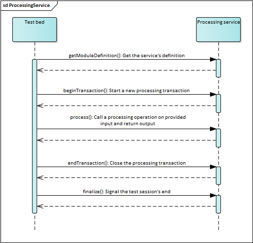

.. _processing:

Processing services
===================

**GITB processing services** are used to extend the capabilities of the Test Bed with domain-specific processing functions.
If a utility function is needed that is not supported natively or is too complex to realise with existing GITB TDL 
constructs, you can add it to the Test Bed on-the-fly by means of a processing service. Their purpose is to receive inputs and produce outputs
through one or more defined operations.

Processing services foresee the definition of **processing transactions**, which can be considered as potentially long-running
conversations that provide context to individual operations. These transactions allow processing services to maintain state relevant to 
a given session through which they can build upon previous work or implement important performance benefits. As an example consider a 
processing service used to selectively retrieve the contents of a ZIP archive. If each interaction with the service was isolated, the 
full ZIP archive would need to be passed to the service with each call and the service implementation would need to extract and read it
for every file access. By maintaining state with processing transactions the service can be provided with the ZIP archive as part of one
operation and then reuse it when looking up individual files. The processing service API foresees appropriate lifecycle operations to signal 
the creation of a new transaction and the finalisation of an existing one (for e.g. clean-up purposes).

Note that support for transactions is **optional** and in cases where it is not needed can be fully skipped. This would be interesting for 
processing actions that are inherently stateless, such as utility functions to generate or manipulate data where each operation is independent. 

The above description mentions the concept of **processing operations**. This is the way in which processing services organise
their work, by defining a set of supported operations, each with distinct inputs and outputs, that form a cohesive whole. You may thus consider
a processing service as a utility library of related operations that can be called as part of a specific transaction (when state is important) or independently. 
Continuing the previous example of a ZIP archive processing service, potential operations could be "initialise" to pass the archive to process, "checkExists" to check if a 
given file exists (but not actually return it), "extract" to lookup and return a file, and "printContents" to return a representation of the archive's contents. 
For an operation to take place a processing transaction must first be established although whether this is actually handled within the service to 
manage session state is up to you.

.. note::
    **Displaying processing steps:** Processing operations used in GITB TDL test cases are by default hidden as they are considered internal
    actions. You may however choose to make such a step visible and return custom information for display to users. See :ref:`processing__using_test_case__visible_context`
    for more details.

.. _processing__implementing:

Implementing the service
------------------------

A GITB processing service is a web application that at least exposes a web service implementing the `GITB processing service API`_.
The easiest way to get up and running is to use the template processing service available as a Maven Archetype (see :ref:`templates`).

Once you have answered the prompts you will have a fully functioning GITB processing service implemented using the `Spring Boot`_ framework
that you can adapt to your specific needs. Alternatively of course you can implement the service from scratch in any way and technology stack you prefer.
In this case a very useful resource is the ``gitb-types`` library that includes classes for all GITB types, service interfaces and service clients. This 
is available on `Maven Central`_ and can be added as a Maven dependency as follows:

.. code-block:: xml

    <dependency>
        <groupId>eu.europa.ec.itb</groupId>
        <artifactId>gitb-types-jakarta</artifactId>
        <version>1.28.5</version>
    </dependency>

.. note::

    The ``gitb-types`` library is also available in a variant with classes using the Javax APIs. See :ref:`common__gitb-types` for details.

Check the :ref:`templates` description for more details on the content and use of the sample processing service. In terms of its initial definition,
a processing service needs to be defined as an implementation of the ``com.gitb.ps.ProcessingService`` interface:

.. code-block:: java

    @Component
    public class ProcessingServiceImpl implements com.gitb.ps.ProcessingService {
        ...
    }

The :ref:`following sections <processing__operations>` cover the service's operations, whereas as the final step you will also need to
:ref:`register the service endpoint <processing__configuring>` as part of your configuration.

.. _processing__operations:

Service operations
------------------

.. note::
    **Service WSDLs and XSDs:** The WSDL and XSD for processing services are listed in the :ref:`specification reference section<introduction__specification_links>`.

The following figure illustrates the operations that a processing service needs to implement and their use by the Test Bed.

  Use of the processing service operations

.. index:: ProcessingOperation
.. index:: getModuleDefinition (Processing)
.. _processing__operations__getModuleDefinition:

getModuleDefinition
~~~~~~~~~~~~~~~~~~~

The ``getModuleDefinition`` operation is used to return information on how the service is expected to be used. In case
the service is specific to a given project and not meant to be published and reused, you can provide an empty implementation
as follows:

.. code-block:: java

    public GetModuleDefinitionResponse getModuleDefinition(Void parameters) {
        return new GetModuleDefinitionResponse();
    }

If you plan to publish a reusable and well-documented service for others to use, it is meaningful to provide a complete implementation.
In this case, this method is used to document:

    * The identification **metadata** of the service.
    * The **configuration** parameters it expects.
    * The **operations** that it supports as well as their individual **inputs** and **outputs**.

Configuration parameters can be seen as parameterisation of the complete service addressing all its operations. Regarding the operations,
each contains:

    * A **name** that serves to identify it and request its execution.
    * A set of zero or more **inputs** that need to be provided for the operation.
    * A set of zero or more **outputs** that the operation will return and be made available in the test session context.

The following example shows a complete implementation of the ``getModuleDefinition`` operation.

.. code-block:: java

    public GetModuleDefinitionResponse getModuleDefinition(Void parameters) {
        GetModuleDefinitionResponse response = new GetModuleDefinitionResponse();
        response.setModule(new ProcessingModule());
        // Set an identifier for the service.
        response.getModule().setId(serviceId);
        response.getModule().setMetadata(new Metadata());
        // Set a name for the service (the identifier is reused here).
        response.getModule().getMetadata().setName(response.getModule().getId());
        // Set a version string for the service.
        response.getModule().getMetadata().setVersion(serviceVersion);
        response.getModule().setConfigs(new ConfigurationParameters());
        // Define the supported operations as well as their input and output parameters.
        TypedParameter inputText = createParameter("input", "string", UsageEnumeration.R, ConfigurationType.SIMPLE, "The input text to process");
        TypedParameter outputText = createParameter("output", "string", UsageEnumeration.R, ConfigurationType.SIMPLE, "The output result");
        response.getModule().getOperation().add(createProcessingOperation("uppercase", Arrays.asList(inputText), Arrays.asList(outputText)));
        response.getModule().getOperation().add(createProcessingOperation("lowercase", Arrays.asList(inputText), Arrays.asList(outputText)));
        return response;
    }

    private ProcessingOperation createProcessingOperation(String name, List<TypedParameter> input, List<TypedParameter> output) {
        ProcessingOperation operation = new ProcessingOperation();
        // Set the operation's name.
        operation.setName(name);
        // Set the operation's inputs.
        operation.setInputs(new TypedParameters());
        operation.getInputs().getParam().addAll(input);
        // Set the operation's outputs.
        operation.setOutputs(new TypedParameters());
        operation.getOutputs().getParam().addAll(output);
        return operation;
    }    

The metadata set for a processing service (identifier, name and version) are not used in practice. The important information that needs to be defined are the 
operations as well as their input and output parameters. In this example the processing service is used to either uppercase or lowercase a provided text. As such,
two appropriately named operations are defined, each accepting an input string named "input" and producing the string output named "output". Creation of the parameters
(done here by calling a ``createParameter()`` method) is documented in :ref:`common__documenting_input_output`.

.. note::
    As of release 1.10.0 you are no longer obliged to define service inputs and outputs (i.e. both are optional), although doing so remains a good practice as it allows
    client-side input verification.

.. index:: beginTransaction (Processing)
.. _processing__operations__beginTransaction:

beginTransaction
~~~~~~~~~~~~~~~~

The ``beginTransaction`` operation is used to signal to the processing service that a new transaction/session is to be started. This operation may also receive 
zero or more configuration properties that could be specific to the transaction in question. In case your processing service does not need to maintain any state
across operations it can completely ignore transactions, leaving the implementation of the ``beginTransaction`` operation empty.

In case maintaining state is meaningful, the processing service is expected to create a session and return its identifier as part of the operation's response. This session is not related
to the test session running in the Test Bed but is rather used only for the internal purposes of the processing service. What the Test Bed guarantees is that the 
identifier that is assigned to this session will be provided back to the processing service as part of every relevant call.

When the processing service wants to maintain transaction/session state it will typically do the following steps in the ``beginTransaction`` operation:

    #. Generate a unique session identifier.
    #. Record the identifier in a way that it can subsequently retrieve it and its associated information. Implementing this session management could be recording it 
       in-memory in a thread-safe map construct or even in a database.
    #. Return the identifier as part of the response.

You also have the option of not returning a specific session identifier here in which case the Test Bed will consider the overall test session identifier instead. 
The difference in this last case is that you will register new sessions during the :ref:`process<processing__operations__process>` operation when a new session ID is encountered.

An example implementation from a session-aware processing service is provided in the following code block:

.. code-block:: java

    /*
     * Define a thread-safe map to store session identifiers and data.
     * Session data is recorded using a map of String keys to Objects.
     */
    private Map<String, Map<String, Object>> sessions = new ConcurrentHashMap<>();

    public BeginTransactionResponse beginTransaction(BeginTransactionRequest beginTransactionRequest) {
        // Generate a new unique session ID.
        String sessionId = UUID.randomUUID().toString();
        // Record the session ID and an initially empty session state.
        sessions.put(sessionId, new HashMap<String, Object>());
        BeginTransactionResponse response = new BeginTransactionResponse();
        // Return the generated session ID as part of the response.
        response.setSessionId(sessionId);
        return response;
    }

From this point on, subsequent operations relevant to the specific session can look it up using its identifier and either add data to its state or read existing
values.

.. index:: process
.. _processing__operations__process:

process
~~~~~~~

The ``process`` operation represents the core of any processing service as it is where its processing is triggered. Although processing logic is domain-specific,
all implementations follow a common sequence of steps:

    #. Retrieve and validate the name of the operation to execute.
    #. [Optional] Retrieve the session identifier to lookup existing session information.
    #. Verify the received operation's inputs to ensure processing can proceed.
    #. Extract the values of the inputs.
    #. Execute the operation.
    #. [Optional] Update the session's state with new information.
    #. [Optional] Enrich the produced status report with additional context information.
    #. Return the result including the status report and produced outputs.

These steps are illustrated in the following code example:

.. code-block:: java

    public ProcessResponse process(ProcessRequest processRequest) {
        // Retrieve the operation's input.
        List<AnyContent> input = getInput(processRequest.getInput(), "INPUT");
        if (input.size() != 1) {
            throw new IllegalArgumentException("No input provided");
        }
        // Extract the input's value.
        String inputValue = getInputValue(input);
        // Retrieve the name of the operation to execute.
        String operation = processRequest.getOperation();
        String result;
        // Execute the operation. Could also be decoupled in a separate component.
        switch (operation) {
            case "uppercase":
                result = inputValue.toUpperCase();
                break;
            case "lowercase":
                result = inputValue.toLowerCase();
                break;
            default:
                // Fail for an unknown operation name.
                throw new IllegalArgumentException(String.format("Unexpected operation [%s]. Expected [%s] or [%s].", operation, "uppercase", "lowercase"));
        }
        ProcessResponse response = new ProcessResponse();
        // Construct a successful status report.
        response.setReport(createReport(TestResultType.SUCCESS));
        // Return the result.
        response.getOutput().add(createAnyContent("OUTPUT", result, ValueEmbeddingEnumeration.STRING));
        return response;
    }

The above example illustrates key steps that are taking place but decouples certain actions into separate methods. These are specifically:

  * The extraction of the input parameter in method ``getInput()``. Multiple input parameters may be present including ones with the same name. See :ref:`common__using_inputs` on
    what you should consider when looking up your inputs.
  * The retrieval of the input value(s) to process in method ``getInputValue()``. An input parameter offers a string value that may initially seem to be the 
    one to use. This however could be BASE64 content or a remote URL that points to the actual content. See :ref:`common__interpreting_input` on what you should consider when retrieving 
    an input's value.
  * The generation of the ``TAR`` status report in method ``createReport()``. For details on how the report should be created check :ref:`common__tar`.
    This report can be used to also :ref:`include context information<processing__using_test_case__visible_context>` that will be presented to users when 
    :ref:`using the service through a test case<processing__using_test_case>`.
  * The generation of the output parameter using method ``createAnyContent()``. For details on how output values are represented check :ref:`common__returning_output`.

Another point to consider from this example is that the actual processing operations (simple string manipulations in this case) are taking place within the
implementation of the ``process`` operation. A cleaner approach for non-trivial cases would be to decouple the processing into a separate component that is not
aware of the GITB service API or constructs, especially considering that the GITB service API may be only one of the service's available interfaces. This is a
design choice that you will need to consider when implementing your processing service.

In case session state is meaningful for your service the ``process`` operation would be the place you would be leveraging it. As an example consider the 
previously mentioned ZIP archive processing service. From a high-level perspective an implementation of this could be as follows:

.. code-block:: java

    public ProcessResponse process(ProcessRequest processRequest) {
        // Get the name of the operation to execute.
        String operation = processRequest.getOperation();
        // Get the current session's ID.
        String sessionId = processRequest.getSessionId();
        ProcessResponse response = new ProcessResponse();
        switch (operation) {
            case "initialise":
                /*
                 * In the "initialise" operation we only receive and cache the archive's bytes.
                 */
                // Extract the archive's bytes from the operation's inputs.
                byte[] archiveBytes = getInput("archive", processRequest);
                // Store the reference to the archive in the session's state.
                sessionManager.set(sessionId, "archive", archiveBytes);
                break;
            case "extract":
                /*
                 * In the "extract" operation we receive the file path to extract but not the full archive.
                 * This operation may be called multiple times.
                 */
                // Extract the value of the file path input parameter.
                String filePath = getInput("filePath", processRequest);
                // Lookup the archive from the session's state and read it using a separate component.
                byte[] fileBytes = zipReader.read(filePath, sessionManager.get(sessionId, "archive"));
                // Add the file's bytes as BASE64 content in the output.
                response.getOutput().add(createAnyContent("FILE", fileBytes, ValueEmbeddingEnumeration.BASE64));
                break;
            default:
                // Fail for an unknown operation name.
                throw new IllegalArgumentException(String.format("Unexpected operation [%s]. Expected [%s] or [%s].", operation, "initialise", "extract"));
        }
        // Construct a successful status report.
        response.setReport(createReport(TestResultType.SUCCESS));
        // Return the result.
        return response;
    }

Parts of this implementation are abstracted (e.g. the session management details, the reading of ZIP entries through a ``zipReader`` component) but the use of 
sessions should be clear. Basically in each ``process`` call you receive the session identifier that you can leverage to associate different calls and to cache shared
state. Finally, note that in such a session-aware service it would be important to have a correct implementation of the :ref:`processing__operations__endTransaction` operation to correctly
clear obsolete state.

.. index:: endTransaction (Processing)
.. _processing__operations__endTransaction:

endTransaction
~~~~~~~~~~~~~~

The ``endTransaction`` operation is the counterpart of :ref:`processing__operations__beginTransaction`. It is used when a processing transaction is considered as completed, either because it
was explicitly ended or because the relevant test session was terminated.

The processing service here is not expected to do much except from cleaning up any state that was being maintained for the session. If of course the service was not 
maintaining sessions the implementation of this operation will be empty.

An ``endTransaction`` implementation for a service that is designed to work with sessions would typically resemble the following example:

.. code-block:: java

    private Map<String, Map<String, Object>> sessions = new ConcurrentHashMap<>();

    public Void endTransaction(BasicRequest parameters) {
        // Retrieve the session ID from the received parameters.
        String sessionId = parameters.getSessionId();
        // Remove the corresponding session.
        sessions.remove(sessionId);
        return new Void();
    }

.. _processing__configuring:

Configuring the web service endpoint
------------------------------------

Apart from implementing the expected web service operations, the processing service needs to correctly publish its service endpoint. Specifically:

  * The name of the service must be "ProcessingServiceService".
  * The name of the service port must be "ProcessingServicePort".
  * The namespace must be set to "http://www.gitb.com/ps/v1/".

Failure to do so will result in the Test Bed not being able to correctly lookup the endpoint to call. The following example illustrates how this 
could be done in a `Spring`_ implementation using `CXF`_:

.. code-block:: java

    @Configuration
    public class ProcessingServiceConfig {
        @Bean
        public Endpoint processingService(Bus cxfBus, ProcessingServiceImpl processingServiceImplementation) {
            EndpointImpl endpoint = new EndpointImpl(cxfBus, processingServiceImplementation);
            endpoint.setServiceName(new QName("http://www.gitb.com/ps/v1/", "ProcessingServiceService"));
            endpoint.setEndpointName(new QName("http://www.gitb.com/ps/v1/", "ProcessingServicePort"));
            endpoint.publish("/process");
            return endpoint;
        }
    }

.. note::

    **Default service address:** Using the above displayed endpoint mapping, and considering (a) no app context path,
    (b) the default port mapping of 8080, and (c) the default CXF root of ``/services``, the full WSDL address would be:
    ``http://localhost:8080/services/process?wsdl``

.. _processing__using_test_case:

Using the service through a test case
-------------------------------------

Use of a processing service in a test case is achieved with the `process`_ step. In case the service foresees transactions, the `process`_ step
will be complemented by the `bptxn`_ and `eptxn`_ steps to start or stop respectively a processing transaction. The following example illustrates
use of a transaction-aware processing service to read a ZIP archive:

.. code-block:: xml

    <!--
        Create a processing transaction named "t1".
    -->
    <bptxn txnId="t1" handler="https://ZIP_PROCESSING_SERVICE?wsdl"/>
    <!-- 
        Call the "initialize" operation to pass the archive to the service.
        The service handler can read and cache the archive for the transaction.
    -->
    <process id="init" txnId="t1">
        <operation>initialize</operation>
        <input name="zip">$zipContent</input>
    </process>
    <!-- 
        Call the "checkExists" operation to see if a given entry exists.
    -->
    <process id="exists" txnId="t1">
        <operation>checkExists</operation>
        <input name="path">'file1.xml'</input>
    </process>
    <!-- 
        Call the "extract" operation to get an entry.
    -->
    <process id="output" txnId="t1">
        <operation>extract</operation>
        <input name="path">'file1.xml'</input>
    </process>
    <!--
        End the transaction.
        The service handler can remove the archive.
    -->
    <eptxn txnId="t1"/>

In terms of mapping GITB TDL steps to service calls the following take place:

  #. The `bptxn`_ step results in constructing a client for the service based on the WSDL provided through the ``handler`` attribute. The 
     :ref:`processing__operations__beginTransaction` operation is subsequently called to create a new processing transaction/session.
  #. The `process`_ steps each trigger a :ref:`processing__operations__process` operation call, passing each time the operation name as well as the expected inputs.
     The output of each call is stored in the test session context using the step's ``id`` value as a reference key.
  #. The `eptxn`_ step results in the :ref:`processing__operations__endTransaction` operation to be called to clean-up the service's session state.

In case your processing service **is stateless** you have no need for the `bptxn`_ and `eptxn`_ steps, neither for the ``txnId`` attribute
on the `process`_ step. In this case however you will need to set directly on the step the ``handler`` implementation. The following example illustrates use 
of a stateless service to perform string manipulations:

.. code-block:: xml

    <!-- Call the processing service without a transaction. -->
    <process id="lowercaseStep" handler="https://ZIP_PROCESSING_SERVICE?wsdl">
        <operation>lowercase</operation>
        <input name="input">$aString</input>
    </process>
    <!-- Access the result. We assume here that the relevant result is named "output". -->
    <log>$lowercaseStep{output}</log>

In the examples listed above you see that the `process`_ step foresees the relevant operation and inputs to be provided by means of child elements. An alternative
to this is to make use of attributes which reduce the amount of XML you need to write for simple operations. Specifically:

    * You can use the ``operation`` attribute instead of the similarly named element to identify the operation to perform.
    * You can use the ``input`` attribute in case your service defines a single input or, in case of multiple inputs, defines a single *required* input.

Considering the use of attributes we can revisit our last example to illustrate a less verbose but otherwise identical call:

.. code-block:: xml

    <!-- Call the processing service without a transaction. -->
    <process id="lowercaseStep" handler="https://ZIP_PROCESSING_SERVICE?wsdl" operation="lowercase" input="$aString"/>
    <!-- Access the result. We assume here that the service's result is named "output". -->
    <log>$lowercaseStep{output}</log>

.. note::
    **Processing outputs:** Check :ref:`common__using_output` for details on how to leverage your service's outputs.

.. _processing__using_test_case__visible_context:

Returning context information for visible process steps
~~~~~~~~~~~~~~~~~~~~~~~~~~~~~~~~~~~~~~~~~~~~~~~~~~~~~~~

When used in test cases via the `process`_ step, the service's operation would typically be part of internal processing that would not be
presented to users. It could nonetheless be interesting to make certain processing steps visible in case sharing their output would provide
useful information to the user. This is possible by defining in the relevant `process`_ step the ``hidden`` attribute as ``false`` (it's
considered by default as ``true``).

.. code-block:: xml

    <!--
        The process step will be visible given that "hidden" is set to false. Note how in this case we also specify
        a description ("desc") to be displayed for the step.
    -->
    <process id="output" hidden="false" desc="Process the input file" handler="$DOMAIN{processingServiceAddress}">
        <input name="path">$inputFile</input>
    </process>

By default when a `process`_ step is made visible it will display as its output the step's overall result (e.g. "SUCCESS")
alongside the processing date/time. You can extend this information with any arbitrary data added as *context* to the
returned report. For example you could return the service's inputs and outputs but also any other information that would be useful.

Returning such additional information is done by :ref:`adding context data to the TAR report<common__returning_output>`. The following
example adds to the service's report a text value corresponding to the service's output:

.. code-block:: java

    public ProcessResponse process(ProcessRequest processRequest) {
        ProcessResponse response = new ProcessResponse();
        // Carry out the service's processing ...
        String outputValue = ...;
        AnyContent output = createAnyContent("output", outputValue, ValueEmbeddingEnumeration.STRING);
        // Add the output to the service's output data.
        response.getOutput().add(output);
        response.setReport(createReport(TestResultType.SUCCESS));
        // Add also to the resulting report for display purposes.
        response.getReport().getContext().getItem().add(output)
        // Return the result.
        return response;
    }

Notice that the output value to return (wrapped in ``output`` in the example) is added both to the response's *output* as well as its
*report*. The output is the actual data that will be recorded and used in the test session. The report's context on the other hand is
not subsequently used, except for the purpose of being displayed to the user. As you are developing the service you have full flexibility
to display the service's output to users (i.e. replicating it in the report's context) or return any information you consider appropriate.

.. _processing__using_standalone:

Using the service standalone
----------------------------

Processing services can also be called in a standalone manner to perform processing actions. You may want to do this if the processing logic you have implemented
for use by the Test Bed is also useful to you outside the context of a test session.

In case your service makes use of transactions/sessions you will first need to create one:

.. code-block:: xml

    <soapenv:Envelope xmlns:soapenv="http://schemas.xmlsoap.org/soap/envelope/" xmlns:v1="http://www.gitb.com/ps/v1/">
        <soapenv:Header/>
        <soapenv:Body>
            <v1:BeginTransactionRequest/>
        </soapenv:Body>
    </soapenv:Envelope>

The response to this will provide you with a session identifier to use. You will need to copy this in each :ref:`processing__operations__process` call as well as signal it in the final 
:ref:`processing__operations__endTransaction` call as follows:

.. code-block:: xml

    <soapenv:Envelope xmlns:soapenv="http://schemas.xmlsoap.org/soap/envelope/" xmlns:v1="http://www.gitb.com/ps/v1/">
        <soapenv:Header/>
        <soapenv:Body>
            <v1:EndTransactionRequest>
                <sessionId>SESSION_ID</sessionId>
            </v1:EndTransactionRequest>
        </soapenv:Body>
    </soapenv:Envelope>

Note that if your service does not make use of transactions/sessions you could simply skip these calls and omit the session identifier for
:ref:`processing__operations__process` calls.

A call to the :ref:`processing__operations__process` operation is illustrated in the following example:

.. code-block:: xml

    <soapenv:Envelope xmlns:soapenv="http://schemas.xmlsoap.org/soap/envelope/" xmlns:v1="http://www.gitb.com/ps/v1/" xmlns:v11="http://www.gitb.com/core/v1/">
        <soapenv:Header/>
        <soapenv:Body>
            <v1:ProcessRequest>
                <!-- The sessionId can be omitted if there is no transaction -->
                <sessionId>SESSION_ID</sessionId>
                <operation>uppercase</operation>
                <input name="input" embeddingMethod="STRING">
                    <v11:value>a text</v11:value>
                </input>
            </v1:ProcessRequest>
        </soapenv:Body>
    </soapenv:Envelope>

The example above should be for the most part self-evident. Points that merit highlighting are:

  * The possibility to pass inputs as-is or in ``CDATA`` blocks (actually this is simply a XML feature).
  * The ``embeddingMethod`` that is set to ``STRING``. This tells the processing service how the text value should be interpreted. Possible values are:

    * ``STRING``: The value is used as-is.
    * ``BASE64``: The value is considered as BASE64-encoded bytes.
    * ``URI``: The value is considered to be the content retrieved from a remote URI reference.

.. _Spring Boot: https://spring.io/projects/spring-boot
.. _Maven Central: https://search.maven.org/
.. _GITB processing service API: https://www.itb.ec.europa.eu/specs/latest/gitb_ps.wsdl
.. _bptxn: https://www.itb.ec.europa.eu/docs/tdl/latest/constructs/index.html#bptxn
.. _eptxn: https://www.itb.ec.europa.eu/docs/tdl/latest/constructs/index.html#eptxn
.. _process: https://www.itb.ec.europa.eu/docs/tdl/latest/constructs/index.html#process
.. _Spring: https://spring.io/
.. _CXF: https://cxf.apache.org/