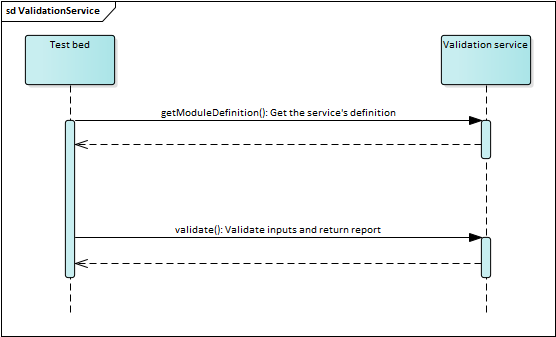

.. _validation:

Validation services
===================

**GITB validation services** are used to validate input and produce a validation report. They are arguably the simplest type
of test service given their specific use which is reflected in the limited operations such a service needs to implement. 
Considering their focus on validation and the simplicity of their API, validation services are also easily used as standalone
services for one-off validation calls.

.. _validation__implementing:

Implementing the service
------------------------

A GITB validation service is a web application that at least exposes a web service implementing the `GITB validation service API`_.
The easiest way to get up and running is to use the template validation service available as a Maven Archetype (see :ref:`templates`)::

  mvn archetype:generate -DarchetypeGroupId=eu.europa.ec.itb -DarchetypeArtifactId=template-validation-service

Once you have answered the prompts you will have a fully functioning GITB validation service implemented using the `Spring Boot`_ framework
that you can adapt to your specific needs. Alternatively of course you can implement the service from scratch in any way and technology stack you prefer.
In this case a very useful resource is the ``gitb-types`` library that includes classes for all GITB types, service interfaces and service clients. This 
is available on `Maven Central`_ and can be added as a Maven dependency as follows:

.. code-block:: xml

  <dependency>
      <groupId>eu.europa.ec.itb</groupId>
      <artifactId>gitb-types</artifactId>
      <version>1.10.1</version>
  </dependency>

Check the :ref:`templates` description for more details on the content and use of the sample validation service. 
The remaining documentation here focuses on the web service operations that need to be implemented.

.. _validation__operations:

Service operations
------------------

The following figure illustrates the operations that a validation service needs to implement and their use by the test bed.

  Use of the validation service operations

.. index:: getModuleDefinition (Validation)
.. _validation__operations__getModuleDefinition:

getModuleDefinition
~~~~~~~~~~~~~~~~~~~

The ``getModuleDefinition`` operation is used to return information on how the service is expected to be used. It documents:

  * The identification **metadata** of the service.
  * The **configuration** parameters it expects.
  * The variable **inputs** that are expected.

The difference between configuration parameters and inputs is more a conceptual point in that configuration parameterises the
validation to take place, whereas inputs represent the actual content to validate. In practice configuration parameters are often
skipped in favour of inputs that serve both to pass the content to validate as well as any additional properties needed by the
validation service.

This operation is the first one to be called when using the service in a standalone manner as it allows the caller to figure out the
inputs it expects. The validation service API defines generally how inputs are passed but not how many in this specific case nor the 
name and value of each one. When used by the test bed this operation is also important as it determines:

  * The types of expected inputs. This enables automatic type conversions when passing the call's parameters.
  * The mandatory inputs. The test bed checks that all required inputs are accounted for before calling the :ref:`validation__operations__validate` operation
    to fail quickly without an unnecessary service call.

The following example shows a complete implementation of the ``getModuleDefinition`` operation.

.. code-block:: java

    public GetModuleDefinitionResponse getModuleDefinition(Void parameters) {
        GetModuleDefinitionResponse response = new GetModuleDefinitionResponse();
        response.setModule(new ValidationModule());
        // Set an identifier for the service.
        response.getModule().setId("MyValidationService");
        // Set "V" as the service's type (for "Validation").
        response.getModule().setOperation("V");
        response.getModule().setMetadata(new Metadata());
        // Set a name for the service (the identifier is reused here).
        response.getModule().getMetadata().setName(response.getModule().getId());
        // Set a version string for the service.
        response.getModule().getMetadata().setVersion("1.0.0");
        response.getModule().setInputs(new TypedParameters());
        // Define the service's input parameters.
        response.getModule().getInputs().getParam().add(createParameter(...));
        response.getModule().getInputs().getParam().add(createParameter(...));
        return response;
    }

The metadata set for a validation service (identifier, name, version and operation) are not used in practice. The only important 
information that needs to be defined are the input parameters. In the above example these are created by calling a custom ``createParameter()`` method.
See :ref:`common__documenting_input_output` for full details on how these parameters need to be defined.  Note that as of release 1.10.0, you are no longer obliged 
to define service inputs (i.e. they are optional), although doing so remains a best practice as it allows client-side input verification.

.. index:: TAR
.. index:: validate
.. _validation__operations__validate:

validate
~~~~~~~~

The ``validate`` operation is used to carry out the validation that this service is meant to perform. The specific validation logic is 
entirely domain-specific, however all ``validate`` implementations follow a common sequence of steps:

  #. Verify the received inputs to ensure validation can proceed.
  #. Extract the values of the inputs.
  #. Run the validation.
  #. Construct the validation report (also adding custom output values to its context if desired).
  #. Return the result.

These steps are illustrated in the following code example:

.. code-block:: java

    public ValidationResponse validate(ValidateRequest parameters) {
        // First extract the parameters and check to see if they are as expected.
        List<AnyContent> input = getInput(parameters);
        if (input.size() != 1) {
            throw new IllegalArgumentException(String.format("This service expects one input to be provided named '%s'", INPUT1_NAME));
        }
        // Retrieve the value to process.
        String inputValue = getInputValue(input);
        // Validate the input and construct the report.
        TAR validationReport = doValidation(inputValue);
        // Return the result.
        ValidationResponse result = new ValidationResponse();
        result.setReport(validationReport);
        return result;
    }

The above example illustrates the key steps that are taking place but decouples certain actions into separate methods. These are specifically:

  * The extraction of the input parameter in method ``getInput()``. Multiple input parameters may be present including ones with the same name. See :ref:`common__using_inputs` on
    what you should consider when looking up your inputs.
  * The retrieval of the input value(s) to process in method ``getInputValue()``. An input parameter offers a string value that may initially seem to be the 
    one to use. This however could be BASE64 content or a remote URL that points to the actual content. See :ref:`common__interpreting_input` on what you should consider when retrieving 
    an input's value.
  * The validation and generation of the report in method ``doValidation()``. This method captures the domain-specific validation logic and is a prime candidate
    to decouple in a separate component. Keep in mind however that the report includes errors and warnings that may need to be generated on-the-fly, which also 
    may include the relevant location in the processed input (if possible). Omitting such details is possible but diminishes the reporting power of your validator
    considering that it would otherwise only report a "success" or "failure" result. As such, it might be necessary to construct the ``TAR`` report as you validate
    or foresee an intermediate GITB-agnostic structure as the result of your validation that you will then convert to the expected ``TAR`` report. These are all points
    to consider when designing your validation service. Details on how the ``TAR`` validation report itself should be populated are provided in :ref:`common__tar`.

.. _validation__configuring:

Configuring the web service endpoint
------------------------------------

Apart from fully implementing the expected web service operations, the validation service needs to correctly publish its service endpoint. Specifically:

  * The name of the service must be "ValidationService".
  * The name of the service port must be "ValidationServicePort".
  * The namespace must be set to "http://www.gitb.com/vs/v1/".

Failure to do so will result in the test bed not being able to correctly lookup the endpoint to call. The following example illustrates how this 
could be done in a `Spring`_ implementation using `CXF`_:

.. code-block:: java

    @Configuration
    public class ValidationServiceConfig {
        @Bean
        public Endpoint validationService(Bus cxfBus, ValidationServiceImpl validationServiceImplementation) {
            EndpointImpl endpoint = new EndpointImpl(cxfBus, validationServiceImplementation);
            endpoint.setServiceName(new QName("http://www.gitb.com/vs/v1/", "ValidationService"));
            endpoint.setEndpointName(new QName("http://www.gitb.com/vs/v1/", "ValidationServicePort"));
            endpoint.publish("/validation");
            return endpoint;
        }
    }

.. _validation__using_test_case:

Using the service through a test case
-------------------------------------

Use of a validation service in a test case is achieved with the `verify`_ step. The following example illustrates use of a service that 
validates a single ``aDocument`` input parameter.

.. code-block:: xml

    <verify handler="https://VALIDATION_SERVICE_ADDRESS?wsdl" desc="Validate against remote service">
        <input name="aDocument">$document</input>
    </verify>

When the `verify`_ step is executed the following actions take place:

  #. A client for the service is constructed based on the WSDL provided through the ``handler`` attribute.
  #. The service's :ref:`validation__operations__getModuleDefinition` operation is called to determine its input parameters.
  #. The inputs are constructed based on the GITB TDL expressions in the test case (in the example the single ``aDocument`` input is populated 
     from the ``document`` context variable).
  #. The :ref:`validation__operations__validate` operation is called to validate the content and retrieve the report.

.. _validation__using_standalone:

Using the service standalone
----------------------------

Validation services can also be called in a standalone manner to perform one-off validations. Cases where such calls are commonly used are during
unit testing to ensure that generated content is valid. The following example illustrates such a call:

.. code-block:: xml

  <?xml version="1.0" encoding="UTF-8"?>
  <soapenv:Envelope xmlns:soapenv="http://schemas.xmlsoap.org/soap/envelope/" xmlns:v1="http://www.gitb.com/vs/v1/" xmlns:v11="http://www.gitb.com/core/v1/">
    <soapenv:Header/>
    <soapenv:Body>
        <v1:ValidateRequest>
          <!-- Any value can be provided for the sessionId element. -->
          <sessionId>12345</sessionId>
          <input name="input1" embeddingMethod="STRING">
            <!-- Provide the input as-is. -->
            <v11:value>a_value</v11:value>
          </input>
          <input name="input2" embeddingMethod="STRING">
              <!-- Provide the input in a CDATA block to avoid XML formatting issues. -->
              <v11:value><![CDATA[Provide content here ...]]></v11:value>
          </input>
        </v1:ValidateRequest>
    </soapenv:Body>
  </soapenv:Envelope>

The example above should be for the most part self-evident. Points that merit highlighting are:

  * The fact that a ``sessionId`` value is needed but for which any value can be safely provided.
  * The possibility to pass inputs as-is or in ``CDATA`` blocks (actually this is simply a XML feature).
  * The ``embeddingMethod`` that is set to ``STRING``. This tells the validation service how the text value should be interpreted. Possible values are:

    * ``STRING``: The value is used as-is.
    * ``BASE64``: The value is considered as BASE64-encoded bytes.
    * ``URI``: The value is considered to be the content retrieved from a remote URI reference.

.. _verify: https://www.itb.ec.europa.eu/docs/tdl/latest/constructs/index.html#verify
.. _Spring Boot: https://spring.io/projects/spring-boot
.. _Maven Central: https://search.maven.org/
.. _GITB validation service API: https://www.itb.ec.europa.eu/specs/latest/gitb_vs.wsdl
.. _Spring: https://spring.io/
.. _CXF: https://cxf.apache.org/